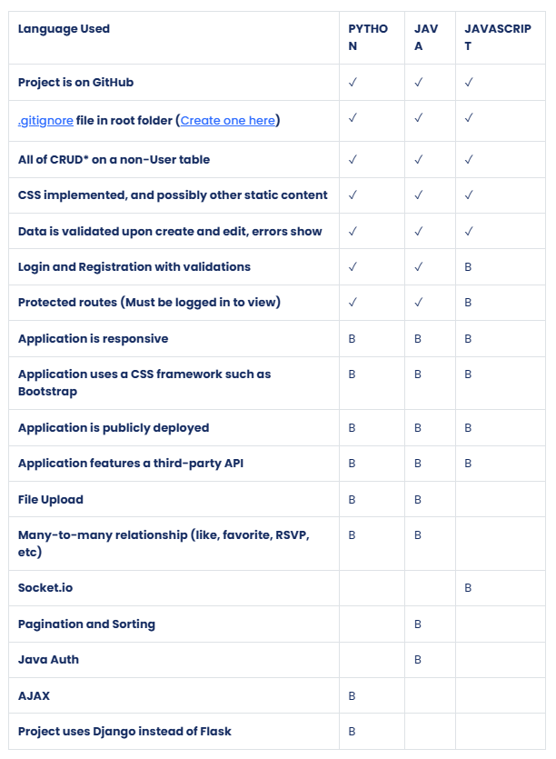

*Before moving on, we want to double-check with you that you have done the prior assignment, **Re-Envisioning Your Schedule.** If not, please go back and do that now, as having a set schedule is important, even in this last stack.*

# Solo Project Proposal

It's time to start putting your bootcamp skills to something you want to share with the world!

Begin by coming up with an idea, either from the listed wireframes, or your own design.  **Your project should NOT be related to a belt exam or a past full-stack assignment.** Your project should advance yourself as a developer, and it can also:

- Relate to a passion or hobby of yours
- Solve or simplify a problem for yourself or somebody
- Perform common good for a community

The front-end/design of your project can be just as important as your back-end, **make sure you allow yourself the time to focus on this as well.**

You should then build up a feature list for what you would want to include in your presentation (Minimum Viable Product or MVP) and features that would be cool, but not crucial (product backlog).

## Project Requirements

✓ - Required, these are mostly competencies that were **required for your Orange/Red belt**

B - Bonus, some are **Black belt** features, while others are within your abilities

* - Create, Read, Update, Delete

## Requirements:

- Complete the Re-Envisioning Your Schedule assignment, setting time aside to focus on your projects, and other time for algorithms.
- In a text file, a description of the project, its stack, a feature list, and GitHub repo link (can be empty at this point). You can include a product backlog that you plan to work on once your MVP is done.
- Create a wireframe image of the project you intend to build.
- Zip/compress both of these in a folder, and submit it for this assignment. Your instructor may want an email with this folder also to approve your project. 