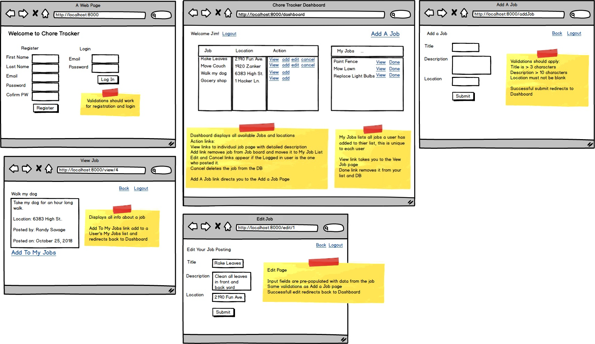

Solo Project (Chore Tracker)
=======

### 🚀 Project Kickoff
- Initialized the Chore Tracker project structure, setting up backend and frontend components.
- Added project documentation to guide future contributors.

### 📦Backend 
- Created the **User** and **Jobs** models to manage user data, job information and relathionships between users and jobs.
- Developed controller:
  - **Home Controller**: Handles user authentication (registration, login) and validations. It manages jobs CRUD operations, including the ability for users to create, edit, delete and view jobs they posted.
- Set up database connectivity using **LINQ** to interact with a MySQL database.

### 💻Frontend 
- Designed UI components based on the provided wireframe:
  - **Login/Register**: Validation for fields like email, password, first name, and last name.
  - **Jobs**: Displays jobs with filters sorting by *Urgent* and *Not Urgent* priority, search bar that filters for Location and Due Date that must be in future.
  - **Favorite Jobs**: Displays all the jobs added by a user to his favorite jobs list.
  - **Job Details**: View job details including description, location, priority, due date, created by which user, favorited by which user.
  - **Add/Edit Job**: Forms to create and modify jobs with required fields validations.
  - **All Jobs created details**: Displays all jobs created by the logged in user ( even if they are taken by another user and don't appear in the all jobs list in the dashboard).

### 🔐Security & Session Management
- Implemented session-based authentication: Users must be logged in to access any part of the site.
- Added logout functionality that clears the session and redirects to the login page.

### 📝Database
- Attached the ChoreTrackerDB.mwb file for database design, including relationships between users, jobs and favorites.

------------------------------------------------

# Solo Project Complete
Upload your completed project! **Use your GitHub link to your project's repository.** If you are needing help with getting your project onto GitHub, schedule a code review, or reach out to your instructor.

Also think about what features you would like to showcase in the Solo Project presentation.  Be prepared to share what went well, what didn't go so well, and any other talking points your fellow cohort mates would find interesting.